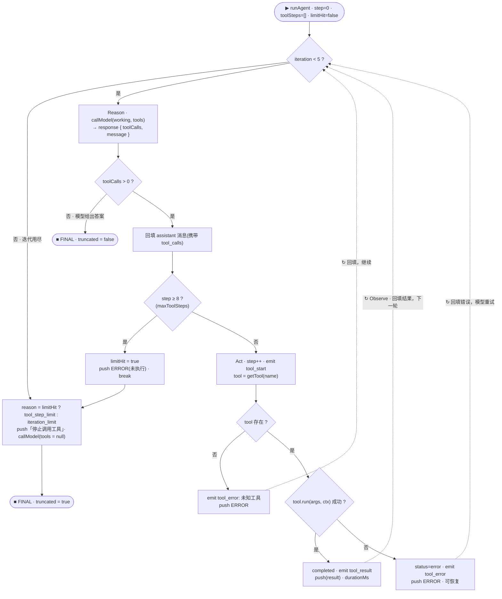
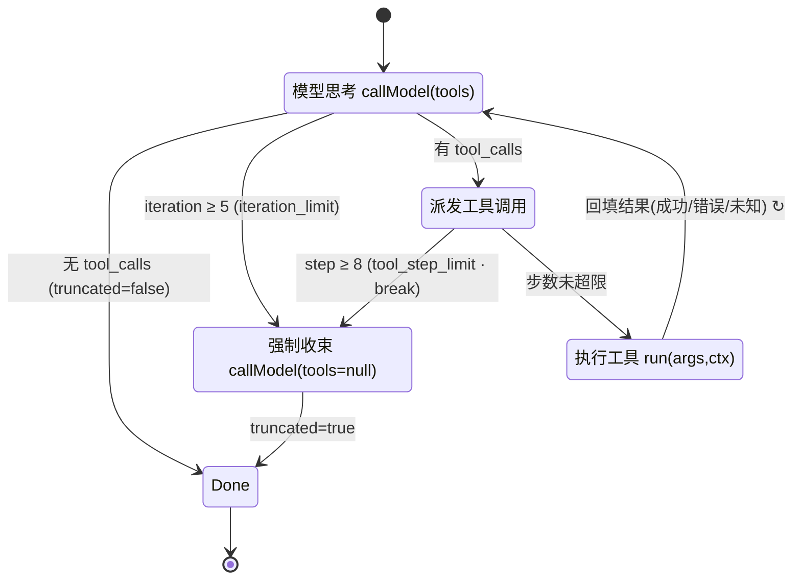
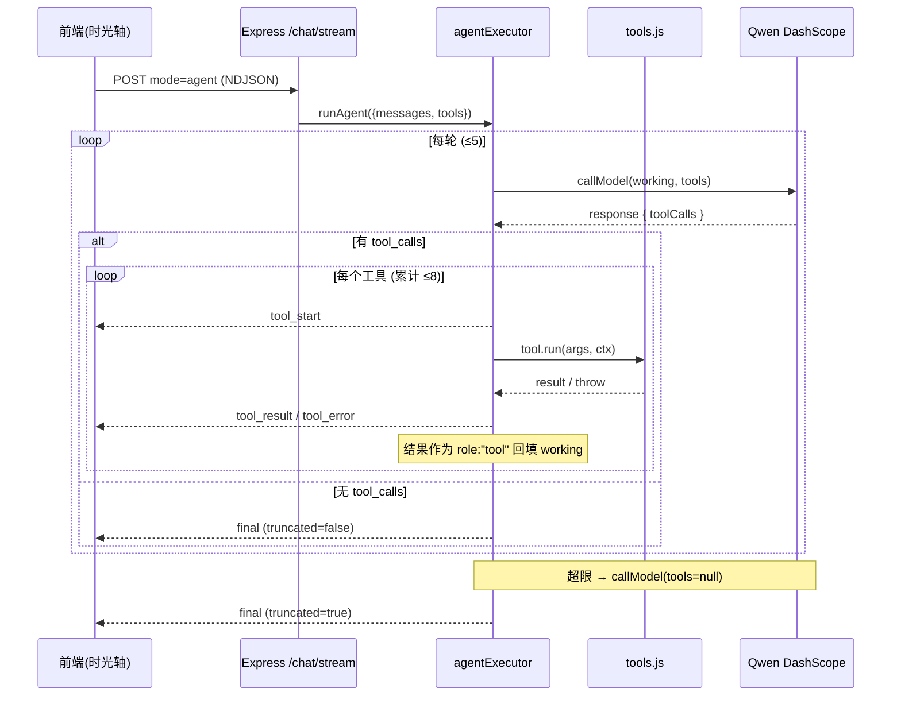

# Qwen Agent Lab · ReAct Agent 控制流解析

> 源文件：`server/agentExecutor.js`（async generator）
> 关键参数：`maxIterations = 5`、`maxToolSteps = 8`
> 内置工具：`calculator` · `file_reader` · `web_search`
> 事件：`tool_start` · `tool_result` · `tool_error` · `final`（经 NDJSON 实时下发到前端「工具链时光轴」）

---

## 1. 控制流程图（Flowchart）



---

## 2. 状态机视图（State Diagram）



---

## 3. 请求时序（Agent 模式 · Sequence）



---

## 4. 三种终止条件

| 路径 | 触发条件 | `truncated` | `truncatedReason` |
|------|----------|-------------|-------------------|
| 自然结束 | 模型本轮不再请求工具 | `false` | `null` |
| 迭代上限 | 主循环跑满 `maxIterations` (5) 仍未收束 | `true` | `iteration_limit` |
| 步骤上限 | 累计工具执行 ≥ `maxToolSteps` (8) | `true` | `tool_step_limit` |

## 5. 统一 tool-step 契约

流事件、最终响应、前端 state、IndexedDB 四处共用同一形状：

```js
{ step, tool, status: "running" | "completed" | "error",
  args, result, error, durationMs }
```

## 6. 设计要点

- **协议回填**：先 `push` 带 `tool_calls` 的 assistant 消息，再按序追加每个 `role:"tool"` 结果，符合 OpenAI 函数调用协议。
- **错误不崩溃**：未知工具与执行抛错都转成 `ERROR:` 文本回填，模型可据此换策略恢复，而非中断整条链。
- **双重限流**：`iteration`（轮）与 `toolSteps`（总步数）各自封顶；任一超限即追加「停止调用工具」指令并以 `tools=null` 强制产出最终答案，杜绝死循环。
- **可测试性**：`callModel` 由调用方注入，executor 与传输层 / 模型厂商解耦，单测可用 Mock 驱动（见 `tests/agentExecutor.test.js`）。
